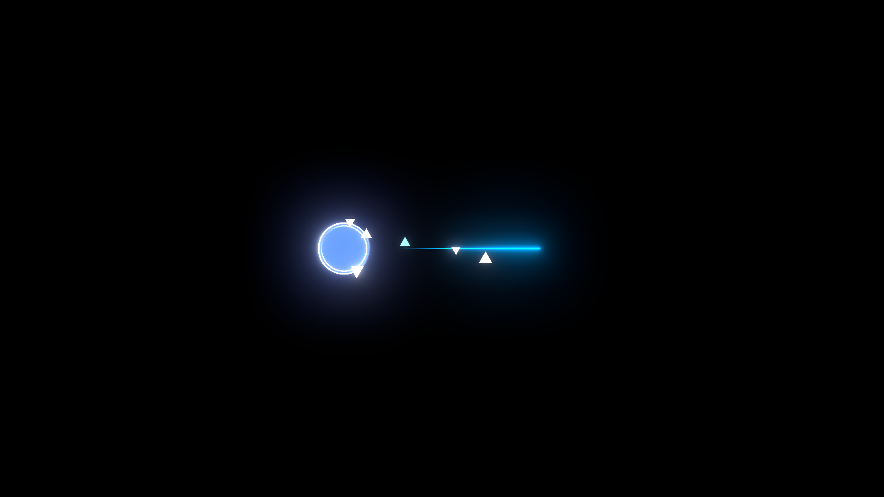

# ba-click-fx-desktop

[English](README.en.md) · [下载最新版本](https://github.com/CialloKing/ba-click-fx-desktop/releases/latest)

[](https://github.com/CialloKing/ba-click-fx-desktop/releases)

统计所有历史 Releases 的附件累计下载次数。

Windows 原生桌面点击特效与鼠标拖尾，以《蔚蓝档案》的 Unity/游戏资源为视觉参考，提供透明覆盖层、
原生控制中心和 OBS 透明特效输出。



*桌面版原生渲染器生成的黑底离屏预览；实际桌面效果随背景与模式变化。*

运行面向 Windows 10/11 x64；安装器最低要求 OS build `19041`。当前人工特效审核以单主屏 SDR 为准。
发布包无需另装 Visual C++ 运行库、Windows App SDK 或开发工具。Host 负责特效，Control Center 负责设置和启停。
控制中心支持简体中文和英文，可在“系统”页即时切换。

## 目录

- [下载与快速开始](#下载与快速开始)
- [常用设置与渲染模式](#常用设置与渲染模式)
- [支持范围与证书](#支持范围与证书)
- [OBS 与 Spout2](#obs-与-spout2)
- [常见问题与反馈](#常见问题与反馈)
- [源码构建](#源码构建)
- [文档入口](#文档入口)
- [Star 历史](#star-历史)
- [开发说明](#开发说明)
- [许可证](#许可证)

## 下载与快速开始

从[官方 Release](https://github.com/CialloKing/ba-click-fx-desktop/releases/latest) 下载。
官方提供四个 Full 版资产：安装器、便携 ZIP，以及各自的 `.sha256` 校验文件。
两种程序包都包含完整特效、Control Center 和 Spout2 发送功能；使用 OBS 时需另装接收插件。
背景感知使用 Windows 屏幕捕获（Windows Graphics Capture，简称 WGC）读取桌面背景。

| 需求 | 选择 | 说明 |
|---|---|---|
| 日常使用、开始菜单与桌面快捷方式 | 安装版 Installer：`*-setup-windows-x64.exe` | 需要管理员 UAC，注册当前用户的应用身份；无边框 WGC 仍需系统授权 |
| 无管理员权限、解压即用 | 便携版 Portable：`*-Portable-windows-x64.zip` | 解压到可写目录；不提供应用身份，不承诺无边框 WGC |

1. 按上表下载安装器或便携 ZIP，以及同名 `.sha256`；校验方法见下方折叠说明。
2. **Installer**：双击安装器并确认 UAC，安装后会打开 Control Center；也可从开始菜单或桌面快捷方式打开。
   **Portable**：完整解压到可写目录，保留目录结构和随附文件，打开 `BAFX.ControlCenter.exe`。
   它必须与 `ba-click-fx-desktop.exe` 位于同一目录才能启动 Host。
3. 点击“启动 Host”，试着点击或按住鼠标拖动即可看到特效；在“基础设置”页调整点击特效、拖尾和背景模式。

<details>
<summary>验证下载文件（SHA-256）</summary>

在 PowerShell 中执行，将占位文件名替换为实际下载的完整文件名：

```powershell
Get-FileHash -Algorithm SHA256 -LiteralPath '.\下载的完整文件名'
Get-Content -LiteralPath '.\下载的完整文件名.sha256'
```

将计算出的 SHA-256 与校验文件首列比较；若不一致，请重新下载后再安装或解压。

</details>

**更新和配置**：在“系统”页手动点击“检查更新”，再下载并运行新安装器，或替换完整便携包的程序文件。
更新前退出 Host 和 Control Center，备份配置；便携版保留自己的配置和预设，再替换完整程序文件。
不要混用不同版本的 Host 与 Control Center。版本检查不会自动下载或安装。

Portable 将 `BAFX.config.json`、`fx-profiles` 和日志保存在 EXE 目录；安装版保存在安装目录的 `data` 子目录。
备份时一并保留同目录的语言偏好文件 `BAFX.ControlCenter.language`。
卸载使用开始菜单卸载项或 Windows“已安装的应用”，默认保留 `data`；需彻底清理时先备份，退出程序并卸载后再删除该目录。

## 常用设置与渲染模式

**界面语言**：在“系统 → 系统行为 → 界面语言”选择“跟随系统 / 简体中文 / English”，立即生效，无需重启，Host 未启动时也可切换。
默认跟随 Windows 当前用户的显示语言：中文使用简体中文，其余语言使用英文。重启后保留选择，“重置默认”保留语言偏好。

Control Center 提供“基础设置”“高级参数”“显示与性能”“快捷键”“系统”五个页面。常用设置包括效果大小、
拖尾长度与宽度、Bloom 强度与质量、随 Windows 启动，以及内置和自定义特效预设。
预设只保存特效参数，不覆盖背景、显示、输入、性能或系统设置。

| 背景模式 | 适用场景与行为 |
|---|---|
| 背景感知（默认） | 日常使用：捕获背景参与合成；捕获不可用或无法排除特效自身时，仅显示特效（FX-only） |
| 录屏兼容（测试） | 尝试让录屏软件也能捕获特效；仅 OS build `26300` 或更高可选，实际录制结果仍待验证 |
| 浅色背景优化 | 无需捕获背景，降低透明度上限，可在浅色桌面上比较效果 |

FX-only 表示只呈现特效、不合入捕获背景，是内部回退路径，不是第四种可选背景模式。
“录屏兼容”在界面中标为“测试，仅 Windows 11 26H2 及以后”；系统版本过低或无法确认时不会应用该选择。
该模式回退到全局窗口排除时，外部录屏可能看不到特效。使用 OBS 时，按 [Spout2 配置](#obs-与-spout2)单独叠加透明特效层，无需启用录屏兼容模式。
三种模式都不承诺在任意桌面背景上逐像素还原游戏画面。

需要降低开销时，选择“核心性能模式（关闭 Bloom 与背景）”：保留圆盘、圆环、碎片和拖尾，关闭光晕与背景捕获，以 SDR、60 FPS 运行。
它与 Full／Slim 构建变体无关。HDR 和其他实验性能选项默认关闭，细节见[开发指南](docs/DEVELOPMENT.md#host-控制面)。

全局快捷键默认全部未绑定，可在“快捷键”页配置暂停／恢复、常驻拖尾、下一个预设和退出 Host。
支持单主键或 Ctrl／Alt／Shift／Win 加单主键，F12 不可绑定；被系统或其他程序占用的组合可能注册失败。
录制完成后点击“保存全部”，确认注册成功后生效；录制本身不会保存绑定。
“重置默认”保留已保存的快捷键和当前暂停／运行状态。

## 支持范围与证书

| 能力 | 当前范围 |
|---|---|
| 点击、拖尾、控制中心 | 面向 Windows 10/11 x64；当前人工特效审核以单主屏 SDR 为准 |
| 背景感知 | 依赖系统捕获能力；不可用时仅显示特效 |
| Windows 11 无边框捕获 | 授权流程和实际显示效果尚未完成目标硬件验收 |
| HDR、多显示器、混合 DPI／刷新率、跨显卡 | 尚未完成完整硬件验收 |
| OBS 透明输出 | 使用 Full 版与 Spout2 插件，按[下节](#obs-与-spout2)配置并检查录制结果 |

详细支持边界与证据见 [SUPPORT.md](SUPPORT.md) 和[验证说明](docs/VALIDATION.md)。

**证书异常时如何处理？** Host 仍可启动，但无边框捕获请求可能失败并回退到仅显示特效。
使用运行 Host 的同一 Windows 用户重新运行当前安装器即可修复，也支持同版本修复。安装成功后，无边框捕获仍需系统授权。

发布安装器没有公有代码签名，SmartScreen 可能显示“Unknown Publisher”。用户无需另行下载证书、MSIX 或 SDK。

<details>
<summary>技术细节：证书、安装状态与验证范围</summary>

安装器在目标机生成本机证书，为提供 Package Identity 的 Sparse Package 签名。每次运行当前安装器都会生成新证书并重新签名。
有效证书不设临期阈值；实际过期、缺失、损坏或签名不匹配时，无边框请求回退 FX-only。

安装状态校验是另一项检查：Control Center 需要完整匹配的 `INSTALL-STATE.json` 与 `.bak` 才能激活安装版 Host。
若显示“安装状态异常”，启动仍会被阻止。请使用运行 Host 的同一 Windows 用户重新运行安装器修复，不要手动删除状态或事务文件。
签名、证书存储及恢复细节见 [ADR-0009](docs/adr/0009-identity-installer-scheme-c.md)。

Windows 11 目标硬件无边框 WGC 的验收状态仍为 **Not Run**：真实用户授权、无边框效果和桌面合成后的最终像素尚未验收。
构建通过、离屏测试或 WARP 软件渲染不能代替真实硬件验证。Full／Slim 和安装器／便携包已有构建、打包验证；Slim 仅供源码构建。

</details>

## OBS 与 Spout2

1. 安装与 OBS 匹配的 [Spout2 接收插件](https://github.com/Off-World-Live/obs-spout2-plugin/releases/)，
   在 Control Center“系统”页勾选“启用 OBS 透明特效输出”，检查发送及插件状态。
2. 在 OBS 将游戏／桌面捕获置底，`Spout2 Capture` 来源置顶，发送者选择 `ba-click-fx-desktop`。
3. Composite Mode 选择 **`Premultiplied Alpha`**；来源混合方式保持 **`Default`**，混合模式保持 **`Normal`**。
4. 对 Spout2 来源执行 `Transform -> Fit to Screen`。空闲时只显示底层画面，点击或拖动时叠加特效。

Spout2 只发送透明特效层，不包含桌面背景，WGC 不可用时也可发送。
插件探测、旧场景迁移和验收方法见 [OBS 使用说明](docs/OBS_SPOUT2.md)。

## 常见问题与反馈

**移动鼠标没有拖尾？** 默认只在按住鼠标时产生拖尾。请先启动 Host，在“基础设置”页确认“鼠标拖尾”已启用；
希望普通移动也有拖尾时，开启“拖尾常驻”。

**屏幕出现黄色边框？** 这是 Windows 的捕获提示，默认允许显示。在“基础设置”页取消“允许黄色捕获边框”后，
只有无边框授权与能力检查通过才会开始捕获，否则回退 FX-only。安装版也需要系统授权。

**关闭控制中心后，特效还在？** Control Center 与 Host 是独立进程。临时暂停可使用“暂停特效”／“恢复特效”按钮或通知区域菜单；
彻底停止请点击“关闭 Host”，或从 Host 的通知区域菜单退出。关闭 Control Center 窗口不会自动停止 Host。

**OBS 中没有特效？** 先确认 Host 已启动且未暂停，在“系统”页勾选“启用 OBS 透明特效输出”，检查发送及插件状态。
再确认 OBS 选择了正确发送者、Spout2 来源置顶且可见，并按[上述步骤](#obs-与-spout2)检查透明合成与画布大小；空闲时全透明是正常现象，请点击或拖动验证。

仍有问题，请到 [GitHub Issues](https://github.com/CialloKing/ba-click-fx-desktop/issues) 反馈，并附上：

- Host 与 Control Center 版本、安装版或便携版。
- Windows 版本与 OS build（可运行 `winver` 查看），以及显示器数量、HDR 状态；OBS 问题另附 OBS 与插件版本。
- 复现步骤、发生时间、预期和实际结果，以及使用的背景模式。
- `ba-click-fx-desktop-support.log`；若相关时段已轮转，再附对应的 `.log.1` 至 `.log.3`。便携版日志在 EXE 目录，安装版在安装目录的 `data` 子目录。

安装或卸载失败时，请附错误框给出的完整路径下的安装日志。公开上传前检查日志中的用户名与本机路径。
更多诊断说明见 [SUPPORT.md](SUPPORT.md)。

## 源码构建

Full／Slim 是构建变体，与安装版／便携版的安装方式无关。Full 包含 Spout2；Slim 去掉 Spout2，仍保留 Host、Control Center 和完整特效。
Slim 仅提供源码构建与本地打包入口，没有官方预编译下载。

准备 Git、Visual Studio 的 **Desktop development with C++** 工作负载、MSVC x64 工具与 Windows SDK 10.0.19041+。
按 Visual Studio 版本选择 CMake：

| Visual Studio | CMake 最低版本 |
|---|---|
| Visual Studio 2022（17.x） | 3.25 |
| Visual Studio 2026（18.x） | 4.2（[生成器说明](https://cmake.org/cmake/help/latest/generator/Visual%20Studio%2018%202026.html)） |

脚本支持 Windows PowerShell 5.1／PowerShell 7；
Python 3 用于完整 Python 合同测试。Node.js 仅供 Unity 资源和 Star 历史等维护工具使用，普通产品构建无需安装。

在 Developer PowerShell 中执行；测试需要已登录且未锁屏的交互式 Windows 桌面：

```powershell
git clone https://github.com/CialloKing/ba-click-fx-desktop.git
cd ba-click-fx-desktop
```

**Full（包含 Spout2）**：首次准备独立 vcpkg；若已有 checkout，直接设置 `VCPKG_ROOT`。

```powershell
git clone https://github.com/microsoft/vcpkg.git C:\dev\vcpkg
& 'C:\dev\vcpkg\bootstrap-vcpkg.bat'
$env:VCPKG_ROOT = 'C:\dev\vcpkg'
cmake --workflow --preset release-verify
```

**Slim（不包含 Spout2，无需 vcpkg）**：

```powershell
cmake --workflow --preset slim-release-verify
```

开发构建的 Host 和 Control Center 分别位于各自的输出目录；启动布局、完整构建、打包、排错、测试和 IPC 示例见[开发指南](docs/DEVELOPMENT.md)。

## 文档入口

- [开发指南](docs/DEVELOPMENT.md)：完整构建、打包、IPC 和资源维护。
- [支持与验证范围](SUPPORT.md)：当前可测试行为、日志和明确排除项。
- [架构](ARCHITECTURE.md)与 [ADR](docs/adr/README.md)：渲染、控制面和安装决策。
- [路线图](docs/ROADMAP.md)、[Spike](docs/SPIKES.md) 与[验证说明](docs/VALIDATION.md)：开发顺序和证据门槛。
- [Unity 参考](docs/UNITY_REFERENCE.md)：视觉参考与外部资源证据边界。
- [更新记录](CHANGELOG.md)：各版本变更。

## Star 历史

独立的 `star-history` 分支保存 Star 数量历史，GitHub Actions 每日北京时间 03:17 调度更新，实际执行可能延迟。

<p align="center">
  <a href="https://github.com/CialloKing/ba-click-fx-desktop/blob/star-history/stars.csv">
    
  </a>
</p>

[查看 CSV 原始数据](https://github.com/CialloKing/ba-click-fx-desktop/blob/star-history/stars.csv)。

<details>
<summary>Star 历史数据如何记录</summary>

初始化之前的数据按现存 Stargazer 的时间重建（`reconstructed`），无法恢复已取消的 Star；
启用后的每日记录为实测总数（`observed`），允许下降。漏跑日期保持缺失，不插值或补造快照。

</details>

## 开发说明

桌面版使用 C++20、Win32、D3D11、HLSL 和 DirectComposition 从零实现。
独立的[网页版 ba-click-fx](https://github.com/CialloKing/ba-click-fx)提供[浏览器演示](https://ba-click-fx.cialloking.top)；
两者共享 Unity/游戏资源这一视觉参考，渲染实现、配置和 IPC 各自独立。

本项目主要通过 AI 生成和迭代完成（**绝无手写代码**），并经过实际运行测试、参数调校和效果校准。
架构合同仍为 **v0.3 / Proposed**，已实现的路径不自动成为硬件支持声明。

## 许可证

[GNU GPL v2](LICENSE)。随附组件许可见 [THIRD-PARTY-NOTICES.txt](THIRD-PARTY-NOTICES.txt)。
